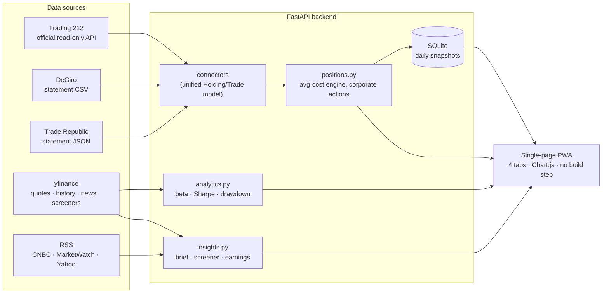

# 📈 Stock Overview


A self-hosted, mobile-first dashboard that **unifies your stock portfolio across
multiple brokers** — Trading 212, DeGiro and Trade Republic — into one live app:
merged positions, exact profit accounting, quant analytics, a daily market
brief, and a transparent small-cap screener.

**Read-only by design: it can never place a trade or move money.**

## ⚡ Try it in 60 seconds (demo mode)

```bash
git clone https://github.com/GidonPeeper/stock-overview.git && cd stock-overview
python3 -m venv .venv && .venv/bin/pip install -r requirements.txt
.venv/bin/uvicorn backend.main:app
# → open http://127.0.0.1:8000  — bundled sample data, no keys needed
```

## ✨ Features

| | |
|---|---|
| 🔀 **Merged holdings** | The same company held at several brokers becomes one position (matched by ISIN) |
| 💶 **Exact P/L accounting** | Real per-trade FX + fees from broker statements; handles splits, delistings, ISIN changes; reconciles with each broker's own figures |
| 📊 **Live market layer** | Index ticker strip, per-holding sparklines, today's movers, tap-through detail sheet with 1D/1W/1M/1Y chart + news |
| 🧠 **Daily Brief** | A generated newsletter: your portfolio's day, risk check, and headlines interleaved from CNBC, MarketWatch & Yahoo Finance |
| 🔬 **Quant analytics** | Beta vs S&P 500, annualized volatility, Sharpe, max drawdown, concentration, currency exposure — flow-adjusted so deposits don't fake returns |
| 🌱 **Rising Stars screener** | Small-caps from Yahoo screeners, re-scored 0–100 with a fully disclosed methodology (momentum / valuation / size) — research leads, not advice |
| 📅 **Earnings calendar** | Upcoming earnings dates for everything you hold |
| 📉 **Performance since inception** | Portfolio value & profit reconstructed from full trade history, with a money-weighted S&P 500 benchmark overlay |
| 📱 **Installable PWA** | Home-screen app with login (Face ID via Keychain), auto-refresh, offline-tolerant loading |
| 🏦 **Net worth view** | Bank/cash accounts (e.g. Rabobank, Revolut) alongside investments — balances edited in-app in seconds, "where your money is" breakdown |
| ⚙️ **Self-service data** | In-app statement uploads with validation + a live/sample diagnostic per source — no host dashboard needed |

## 🏗 Architecture



## 🔑 Using your own data

Everything private is git-ignored and resolved from `data/`, the project root,
or `/etc/secrets` (Render Secret Files) — the in-app banner tells you exactly
which sources are live vs sample.

1. **Trading 212** — create a **read-only** API key (Settings → API, no ordering
   scope), put it in `.env` (`cp .env.sample .env`).
2. **DeGiro** — export your full account statement CSV to `data/degiro_account.csv`.
3. **Trade Republic** — transcribe trades/dividends from the statement PDF into
   `data/trades_trade_republic.json` / `income_trade_republic.json` (formats in
   the `.sample` files).
4. Optional: `NEWSAPI_KEY` in `.env` blends NewsAPI into the Daily Brief.

## ☁️ Deploy

Free 24/7 hosting on Render with the repo public and your data private
(env vars + Secret Files): see [`DEPLOY_RENDER.md`](DEPLOY_RENDER.md).

## 🔒 Privacy & safety

- The repo contains **code + sample data only** — statements and keys never
  enter git in plaintext (verified: no secrets anywhere in history). The owner's
  data ships only as `data/vault.enc`: Fernet-encrypted (PBKDF2, 600k
  iterations) with a key that lives exclusively in the host's environment.
- The Trading 212 key is **read-only**: worst case is viewing, never trading.
- The dashboard sits behind a session login; iOS unlocks it with Face ID.

## 🛠 Stack

FastAPI · vanilla JS + Chart.js (no build step) · SQLite · yfinance · RSS/stdlib.

## License

MIT — see [LICENSE](LICENSE).
